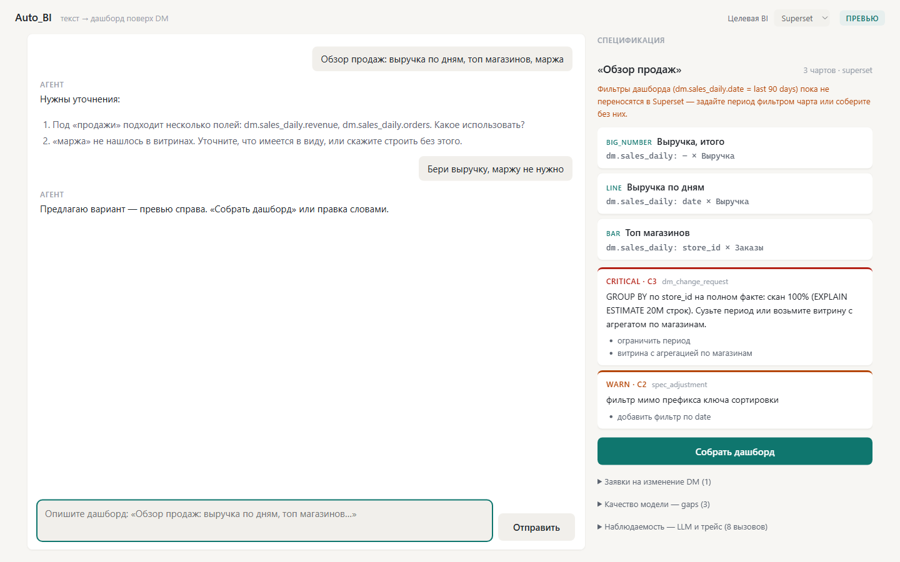
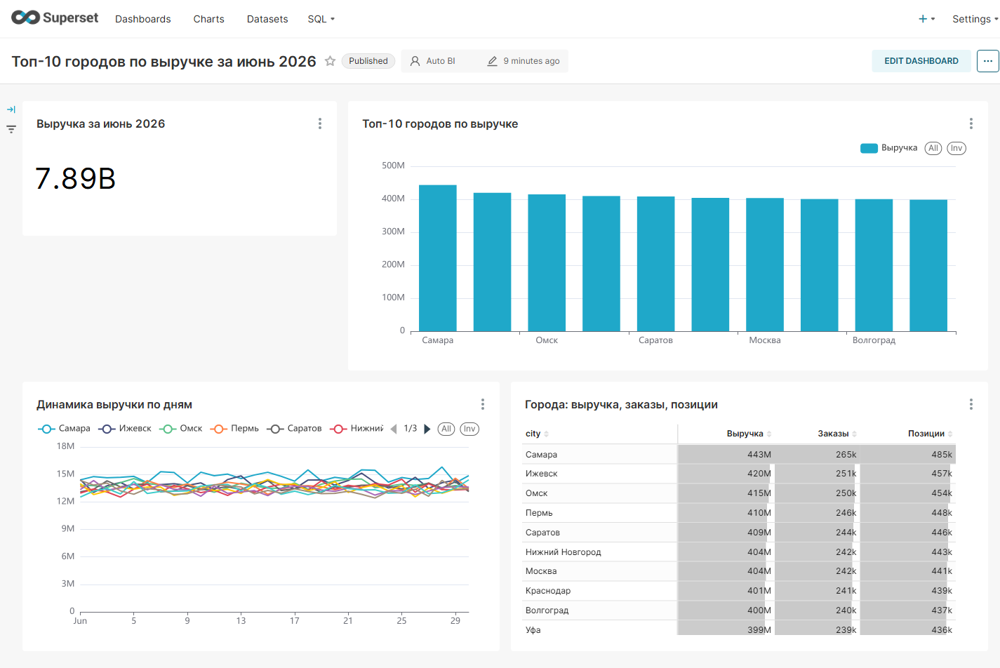
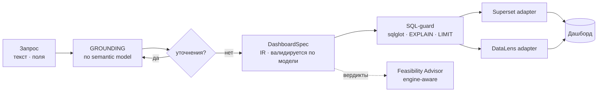

# Auto_BI

[](https://github.com/brownjuly2003-code/Auto_BI/actions/workflows/ci.yml)     

Агент «запрос → дашборд» поверх DM-слоя DWH. Принимает запрос **текстом, drag&drop-раскладкой полей витрин или авто-обзором витрины** (детерминированный курируемый дашборд без LLM), уточняет детали только при реальных расхождениях с данными, честно предупреждает о не предусмотренных витриной паттернах (engine-aware **Feasibility Advisor** — вплоть до «это запрос на новую витрину»), строит дашборд в выбранной BI и возвращает ссылку.

**Скоуп v1 (RU-рынок):** ClickHouse (DM) + Apache Superset (BI). v2: Greengage/Greenplum + Yandex DataLens (self-hosted OSS-стенд). Универсальность — в швах (IR, адаптеры), не в имплементации.
**LLM:** прямой Anthropic Messages API (по умолчанию — нужен только `ANTHROPIC_API_KEY`); локальный сервис GraceKelly — документированная опция (`AUTO_BI_LLM_PROVIDER=gracekelly`, см. [USER_GUIDE §6](docs/USER_GUIDE.md#6-конфигурация-переменные-окружения)).

## Демо

| Веб-UI: запрос → спецификация + Feasibility Advisor | Собранный дашборд (Superset) |
|:--:|:--:|
|  |  |

Слева — естественно-языковой запрос, уточнения агента, превью спецификации (IR) и вердикты Feasibility Advisor (CRITICAL → заявка владельцу DM, WARN → правка спеки). Справа — собранный из той же спецификации дашборд Superset на реальных данных ClickHouse.

## Статус

**Phase 0–4 + бэклог адекватности дашбордов (B1–B4) закрыты.** Работает end-to-end: текст/поля → spec → валидация → сборка дашборда. v1-стек (ClickHouse + Superset) и v2-стек (Greenplum/Greengage интроспекция + advisor; self-hosted DataLens-адаптер) live-проверены; web UI с двумя режимами ввода, итерациями, Feasibility Advisor, заявками владельцу DM и панелью наблюдаемости. Остаток — owner/стенд-зависимый (адаптеры Visiology/Luxms). История фаз и план — в [docs/PLAN.md](docs/PLAN.md).

## Чем отличается

Зрелого бесплатного инструмента «диалог → целый дашборд поверх DWH с выбором BI» нет ни в России, ни глобально (обзор с проверкой первоисточников — [docs/MARKET.md](docs/MARKET.md)). Три отличия от существующих NL→chart-решений:

- **Grounding по конкретному DM, а не свободный чат** — уточнения только при реальных расхождениях запроса с витриной; однозначный запрос → ноль вопросов.
- **Дашборд целиком из BI-агностичного IR** (layout, фильтры, N чартов) — а не один чарт по готовому датасету (отличие от DataLens «Нейроаналитик»). Один spec → Superset и DataLens.
- **Engine-aware Feasibility Advisor** — детерминированно сверяет запрос с физикой витрины (ключи сортировки/партиции, EXPLAIN) и прямо говорит «такой дашборд витриной не предусмотрен, вот evidence и заявка владельцу DM». Этого нет ни у одного конкурента.



## Как пользоваться

Установка, команды CLI, web UI, конфигурация — [docs/USER_GUIDE.md](docs/USER_GUIDE.md).
Подключение новой витрины DWH за ≤ 1 ч — [docs/ONBOARDING_DWH.md](docs/ONBOARDING_DWH.md).

```bash
pip install -e .                                  # консольная команда auto_bi
auto_bi introspect --output semantic/model.yaml   # DWH -> черновик модели
auto_bi build "Выручка по магазинам за июнь 2026"  # текст -> дашборд
auto_bi build --auto dm.sales_daily                # витрина -> обзорный дашборд (без LLM)
auto_bi serve                                     # web UI на http://127.0.0.1:8200
```

Хотите увидеть весь конвейер за минуту, без стенда и без LLM — на синтетической витрине из репозитория:

```bash
uv run python scripts/demo_golden_path.py
```

Скрипт прогоняет детерминированную часть end-to-end: семантическая модель → курируемый
обзорный дашборд → валидированный SQL по каждому чарту → вердикт Feasibility Advisor
(включая `dm_change_request` — «витрина не предусматривает такой разрез, вот evidence»).
Живым остаётся только финальный BUILD (HTTP к Superset/DataLens + EXPLAIN на стенде).

## Документация

| Файл | Что внутри |
|---|---|
| [docs/USER_GUIDE.md](docs/USER_GUIDE.md) | Руководство пользователя: установка, команды CLI, web UI, два режима ввода, advisor, наблюдаемость, конфигурация |
| [docs/ONBOARDING_DWH.md](docs/ONBOARDING_DWH.md) | Подключение нового DWH за ≤ 1 ч: доступы, `.env`, интроспекция, обогащение, проверка (ClickHouse + Greenplum) |
| [docs/ARCHITECTURE.md](docs/ARCHITECTURE.md) | Архитектура: скоуп, IR-first, семантическая модель с физическим слоем, агент, Feasibility Advisor, адаптеры, LLM-слой, решения D1–D10, риски |
| [docs/PLAN.md](docs/PLAN.md) | План: Phase 0–4, задачи, exit criteria; полезный продукт после Phase 2 (~2.5–3 мес FTE) |
| [docs/MARKET.md](docs/MARKET.md) | Рынок на 06.2026: RU (СУБД, BI, AI-фичи конкурентов, статус Superset) + глобальный контекст |

## Суть архитектуры в одном абзаце

LLM никогда не генерирует нативные форматы BI. Пайплайн: запрос (текст или раскладка полей) → grounding по семантической модели (`model.yaml`, включая физический слой движка) → уточнения при необходимости → **DashboardSpec** (BI-агностичный JSON, жёстко валидируется по модели) → SQL с проверкой (sqlglot/EXPLAIN/LIMIT) → детерминированный компилятор-адаптер строит дашборд через API выбранной BI. Параллельно детерминированный **Feasibility Checker** сверяет запрос с физикой витрины (ключи сортировки/партиции, размеры, EXPLAIN) — advisor прямо говорит, когда дашборд витриной не предусмотрен, и умеет оформить заявку владельцу DM. Один spec — N платформ.

## Разработка

```bash
uv sync                                              # окружение из uv.lock (вкл. dev-инструменты)
uv run ruff check .                                  # линтер
uv run black --check auto_bi tests                   # формат
uv run pytest -q                                     # тесты (integration-сьюты со стендом — deselected)
uv run --with pytest-cov pytest --cov=auto_bi --cov-report=term-missing   # покрытие
uv run python scripts/verify_live_clickhouse.py      # числа CH-путей на ЖИВОМ стенде (ratio/grain/yoy/авто-обзор)
```

Те же шаги гоняет CI на push/PR ([.github/workflows/ci.yml](.github/workflows/ci.yml)). Текущее покрытие — **93 %** (369 unit/API-тестов; сьюты с пометкой `integration` требуют живого стенда ClickHouse/Superset/DataLens и в CI не запускаются).

## License

MIT. See [LICENSE](LICENSE).
