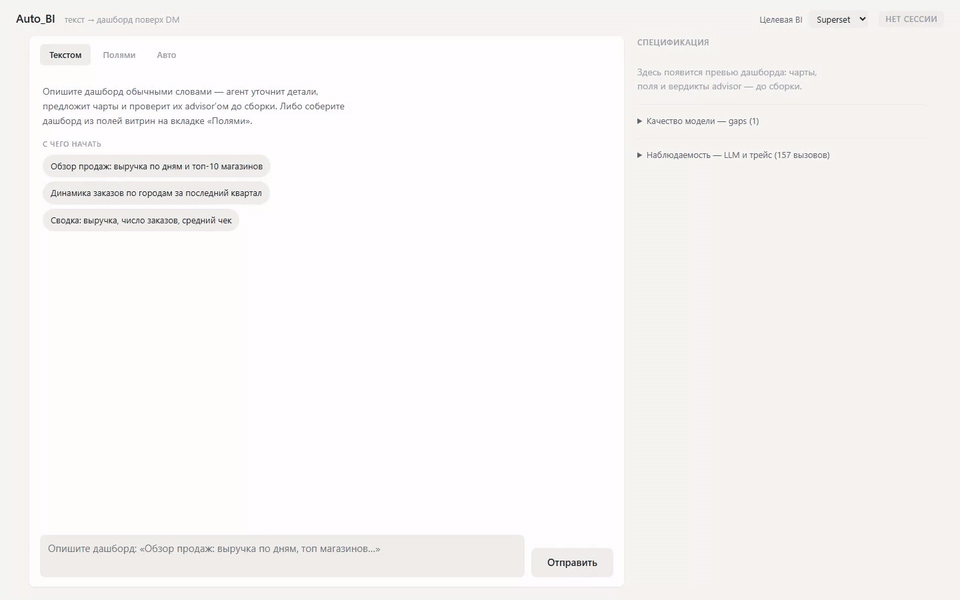
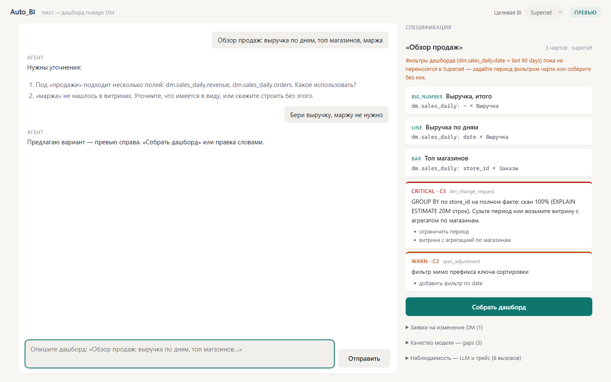
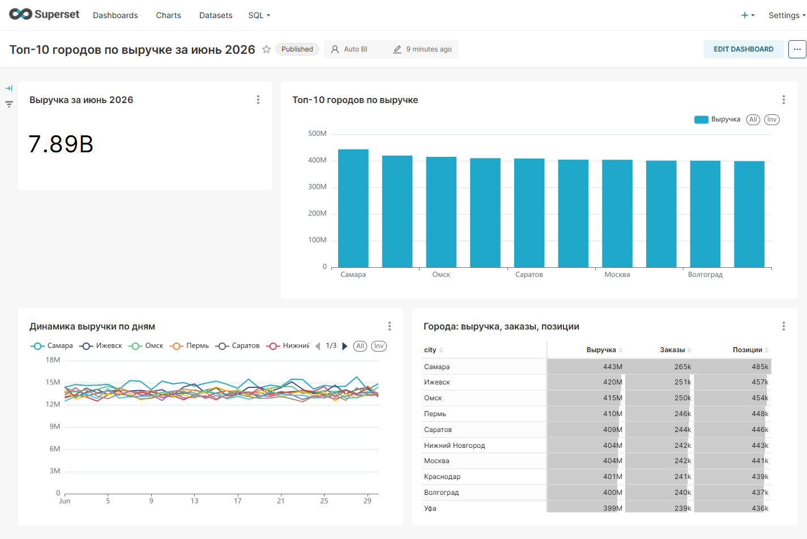
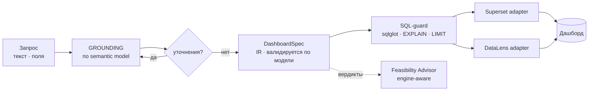

# Auto_BI

[](https://github.com/brownjuly2003-code/Auto_BI/actions/workflows/ci.yml)     

Агент «запрос → дашборд» поверх DM-слоя DWH. Принимает запрос **текстом, drag&drop-раскладкой полей витрин или авто-обзором витрины** (детерминированный курируемый дашборд без LLM), уточняет детали только при реальных расхождениях с данными, честно предупреждает о не предусмотренных витриной паттернах (engine-aware **Feasibility Advisor** — вплоть до «это запрос на новую витрину»), строит дашборд в выбранной BI и возвращает ссылку.

**Скоуп v1 (RU-рынок, release-gated в CI):** ClickHouse (DM) + Apache Superset (BI). **v2 experimental:** Greengage/Greenplum (offline advisor/golden в CI; live DWH — operator stand) + Yandex DataLens (unit compile offline; live contract Mac-only, не default release gate). Универсальность — в швах (IR, адаптеры), не в имплементации.
**LLM:** прямой Anthropic Messages API по умолчанию; прямой Mistral Chat Completions (`AUTO_BI_LLM_PROVIDER=mistral`, `MISTRAL_API_KEY`) и локальный сервис GraceKelly — документированные опции (см. [USER_GUIDE §6](docs/USER_GUIDE.md#6-конфигурация-переменные-окружения)).

## Демо

**Поддерживаемый путь без стенда:** офлайн golden path
(`uv run python scripts/demo_golden_path.py`) — детерминированный IR/SQL/advisor
без DWH, BI и LLM. Полный локальный запуск со своим API key —
[docs/LOCAL_BYOK.md](docs/LOCAL_BYOK.md).

Публичный Hugging Face Space
(<https://juliome20-auto-bi-demo.hf.space>) **не** является verified/supported
launch path для v0.5.0: last recorded live evidence is historical/stale
(served `0.4.0`, `demo_auto_only=false`, no `health.capabilities`) and is
incompatible with the current release. Do not treat it as a confirmed working
auto-only demo. Ниже — скриншоты и видео полного цикла (архив UI), не live-assert.



Живой цикл (сжаты только паузы ожидания LLM): запрос «средний чек по месяцам, Парето по магазинам, динамика количества» → агент уточняет неоднозначное «количество» (orders vs items) → превью спецификации с вердиктом Feasibility Advisor (CRITICAL: запрос сканирует 100% витрины в 20 млн строк — предложение сузить период) → сборка → готовый дашборд Superset на реальных данных ClickHouse: средний чек как производная метрика `sum(revenue)/sum(orders)` по месяцам, Парето — накопленная доля выручки по магазинам. Видео в лучшем качестве — [docs/screenshots/demo.mp4](docs/screenshots/demo.mp4).

| Веб-UI: запрос → спецификация + Feasibility Advisor | Собранный дашборд (Superset) |
|:--:|:--:|
|  |  |

Слева — естественно-языковой запрос, уточнения агента, превью спецификации (IR) и вердикты Feasibility Advisor (CRITICAL → заявка владельцу DM, WARN → правка спеки). Справа — собранный из той же спецификации дашборд Superset на реальных данных ClickHouse.

## Статус

**Phase 0–4 + бэклог адекватности дашбордов (B1–B4) закрыты.** Работает end-to-end: текст/поля → spec → валидация → сборка дашборда. v1-стек (ClickHouse + Superset) live-проверен на v0.5.0; v2 (Greenplum/Greengage advisor/golden; DataLens) — offline evidence/contracts, DataLens live не гонялся (каталоги/конфиг Mac-стенда на месте; на read-only probe 2026-07-29 сервисы остановлены/не ready; exact live contract **not run**; experimental / non-default / non-closure); web UI с двумя режимами ввода, итерациями, Feasibility Advisor, заявками владельцу DM и панелью наблюдаемости.

**Актуальное состояние и residual roadmap** — [docs/CURRENT_STATE.md](docs/CURRENT_STATE.md). История фаз — [docs/PLAN.md](docs/PLAN.md). Полный env inventory (generated) — [docs/ENV_REFERENCE.md](docs/ENV_REFERENCE.md).

## Чем отличается

Зрелого бесплатного инструмента «диалог → целый дашборд поверх DWH с выбором BI» нет ни в России, ни глобально (обзор с проверкой первоисточников — [docs/MARKET.md](docs/MARKET.md)). Три отличия от существующих NL→chart-решений:

- **Grounding по конкретному DM, а не свободный чат** — уточнения только при реальных расхождениях запроса с витриной; однозначный запрос → ноль вопросов.
- **Дашборд целиком из BI-агностичного IR** (layout, фильтры, N чартов) — а не один чарт по готовому датасету (отличие от DataLens «Нейроаналитик»). Один spec → Superset и DataLens.
- **Engine-aware Feasibility Advisor** — детерминированно сверяет запрос с физикой витрины (ключи сортировки/партиции, EXPLAIN) и прямо говорит «такой дашборд витриной не предусмотрен, вот evidence и заявка владельцу DM». Этого нет ни у одного конкурента.


```mermaid
flowchart LR
    Q["Запрос<br/>текст · поля"] --> G["GROUNDING<br/>по semantic model"]
    G --> C{"уточнения?"}
    C -->|да| G
    C -->|нет| S["DashboardSpec<br/>IR · валидируется по модели"]
    S --> SQL["SQL-guard<br/>sqlglot · EXPLAIN · LIMIT"]
    S -.->|вердикты| ADV["Feasibility Advisor<br/>engine-aware"]
    SQL --> A1["Superset adapter"]
    SQL --> A2["DataLens adapter"]
    A1 --> D[("Дашборд")]
    A2 --> D
```

## Как пользоваться

Установка, команды CLI, web UI, конфигурация — [docs/USER_GUIDE.md](docs/USER_GUIDE.md).
Подключение новой витрины DWH за ≤ 1 ч — [docs/ONBOARDING_DWH.md](docs/ONBOARDING_DWH.md).

Local-first — три ступени:

1. **Офлайн golden path** — без DWH, BI, LLM и API-ключа:

```bash
uv run python scripts/demo_golden_path.py
```

2. **HF Space (исторический, не supported)** — публичный Space больше не
   verified launch path: last recorded profile is stale vs v0.5.0
   (`0.4.0` / `demo_auto_only=false` / no capabilities). Не рассчитывать на
   auto-only demo и не использовать как текущий onboarding. См. «Демо» выше;
   вместо этого — golden path (п.1) или LOCAL_BYOK (п.3).

3. **Полный локальный путь.** Пошаговый Anthropic-пример — [docs/LOCAL_BYOK.md](docs/LOCAL_BYOK.md). Скопируйте `.env.example` в `.env` (`cp .env.example .env`; PowerShell: `Copy-Item .env.example .env`). Задайте свой `ANTHROPIC_API_KEY`; либо `AUTO_BI_LLM_PROVIDER=mistral` + `MISTRAL_API_KEY`; либо `AUTO_BI_LLM_PROVIDER=gracekelly` + `AUTO_BI_GRACEKELLY_URL`. Для DWH/BI — `AUTO_BI_CH_HOST`, `AUTO_BI_CH_PASSWORD`, `AUTO_BI_SUPERSET_URL`, `AUTO_BI_SUPERSET_PASSWORD` (полный inventory — [docs/ENV_REFERENCE.md](docs/ENV_REFERENCE.md)). `docker compose up -d` поднимает **только ClickHouse и Superset**, не Auto_BI; агент локально: `auto_bi serve` → http://127.0.0.1:8200.

```bash
pip install autobi-agent                          # или pip install -e . из корня репозитория
auto_bi introspect --output semantic/model.yaml   # DWH -> черновик модели
auto_bi build "Выручка по магазинам за июнь 2026"  # текст -> дашборд
auto_bi build --auto dm.sales_daily                # витрина -> обзорный дашборд (без LLM)
auto_bi serve                                     # web UI на http://127.0.0.1:8200
```

Хотите увидеть весь конвейер за минуту, без стенда и без LLM — на синтетической витрине из репозитория:

```bash
uv run python scripts/demo_golden_path.py
```

Скрипт прогоняет детерминированную часть end-to-end: семантическая модель → курируемый
обзорный дашборд → скомпилированные примеры SQL для KPI и разреза с JOIN → вердикт Feasibility Advisor
(включая `dm_change_request` — «витрина не предусматривает такой разрез, вот evidence»).
Живым остаётся только финальный BUILD (HTTP к Superset/DataLens + EXPLAIN на стенде).

## Документация

| Файл | Что внутри |
|---|---|
| [docs/USER_GUIDE.md](docs/USER_GUIDE.md) | Руководство пользователя: установка, команды CLI, web UI, два режима ввода, advisor, наблюдаемость, конфигурация |
| [docs/LOCAL_BYOK.md](docs/LOCAL_BYOK.md) | Первый локальный запуск со своим Anthropic API key: clone, `.env`, Compose (CH+Superset), `uv run auto_bi serve`, health/ready |
| [docs/ONBOARDING_DWH.md](docs/ONBOARDING_DWH.md) | Подключение нового DWH за ≤ 1 ч: доступы, `.env`, интроспекция, обогащение, проверка (ClickHouse + Greenplum) |
| [docs/ARCHITECTURE.md](docs/ARCHITECTURE.md) | Архитектура: скоуп, IR-first, семантическая модель с физическим слоем, агент, Feasibility Advisor, адаптеры, LLM-слой, решения D1–D10, риски |
| [docs/DEPLOYMENT.md](docs/DEPLOYMENT.md) | Деплой в проде: workers=1, reverse-proxy/TLS, готовность, docker-compose, бэкап SQLite, ротация логов, чеклист секретов |
| [CHANGELOG.md](CHANGELOG.md) | История версий по [Keep a Changelog](https://keepachangelog.com/ru/1.1.0/) — что вошло в каждый релиз |
| [docs/PLAN.md](docs/PLAN.md) | План: Phase 0–4, задачи, exit criteria; полезный продукт после Phase 2 (~2.5–3 мес FTE) |
| [docs/MARKET.md](docs/MARKET.md) | Рынок на 06.2026: RU (СУБД, BI, AI-фичи конкурентов, статус Superset) + глобальный контекст |

Ссылки вида `internal/<дата>-<тема>.md` в доках и докстрингах указывают на рабочие
runbook'и и дизайн-ноты, которые живут во внутреннем репозитории и не публикуются:
это разборы стендов, машин и ходов отладки. Всё, что имеет продуктовое значение,
перенесено в поддерживаемые доки из таблицы выше — ссылка оставлена как след
происхождения решения, а не как обязательное чтение.

## Суть архитектуры в одном абзаце

LLM никогда не генерирует нативные форматы BI. Пайплайн: запрос (текст или раскладка полей) → grounding по семантической модели (`model.yaml`, включая физический слой движка) → уточнения при необходимости → **DashboardSpec** (BI-агностичный JSON, жёстко валидируется по модели) → SQL с проверкой (sqlglot/EXPLAIN/LIMIT) → детерминированный компилятор-адаптер строит дашборд через API выбранной BI. Параллельно детерминированный **Feasibility Checker** сверяет запрос с физикой витрины (ключи сортировки/партиции, размеры, EXPLAIN) — advisor прямо говорит, когда дашборд витриной не предусмотрен, и умеет оформить заявку владельцу DM. Один spec — N платформ.

## Разработка

```bash
uv sync                                              # окружение из uv.lock (вкл. dev-инструменты)
uv run ruff check .                                  # линтер
uv run black --check auto_bi tests                   # формат
uv run --with duckdb pytest -q                       # тесты (integration-сьюты со стендом — deselected)
uv run --with duckdb --with pytest-cov pytest --cov=auto_bi --cov-report=term-missing   # покрытие
uv run python scripts/verify_live_clickhouse.py      # числа CH-путей на ЖИВОМ стенде (ratio/grain/yoy/compare-KPI/авто-обзор)
```

`--with duckdb` — эфемерная test-dep (проверяет numeric-корректность transform-SQL под postgres-семантикой окон; без неё те тесты `importorskip`). Те же шаги гоняет CI на push/PR ([.github/workflows/ci.yml](.github/workflows/ci.yml)). Покрытие в бейдже выше генерируется самим CI на каждый push в main (`.github/badges/coverage.json`, из `coverage report --format=total`) — не статичное число.

**Compatibility gates (plan_sol step 10):** primary offline quality на Python 3.12; дополнительно job `Lint & tests (Python latest)` (3.13) и `Windows package/CLI smoke`. Dependency resolution matrix (locked / latest-compatible / lowest-direct) — step 6. Superset-контрактный сьют (`tests/test_superset_contract.py`) + живой `auto_bi build --auto` + browser E2E — job `integration` на docker-compose ClickHouse+Superset. Greenplum — offline advisor + golden replay в quality (live GP stand experimental). DataLens live contract (`tests/test_datalens_contract.py`) — Mac-only experimental, не в default CI. Матрица claims↔gates: `tests/test_compatibility_matrix.py`. Job `docker` собирает образ на каждый PR; на тег `vX.Y.Z` — `.github/workflows/release.yml` → GHCR + GitHub Release из [CHANGELOG.md](CHANGELOG.md).

## License

MIT. See [LICENSE](LICENSE).
